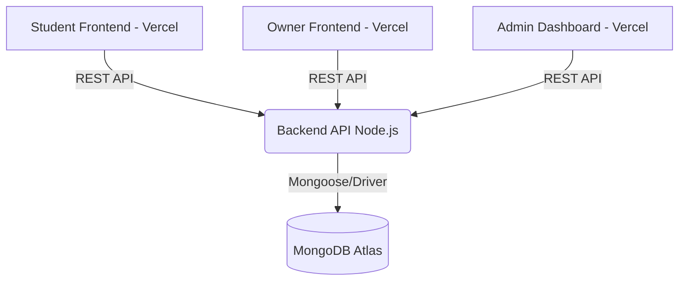

# MOV Stay - Smart Student Accommodation Platform

**Match • Optimize • Verify**

MOV Stay is an AI-powered PG and Hostel discovery platform designed to help students find safe, affordable, and reliable accommodation. The platform connects students, property owners, and administrators through a unified ecosystem that enables property discovery, analytics-driven insights, and intelligent roommate matching.

The system improves transparency in the student housing ecosystem by combining property listings, neighborhood intelligence, recommendation systems, and platform analytics.

## Problem Statement

Students moving to new cities for education often face difficulty finding reliable accommodation. Common challenges include:
- Lack of transparent information about PGs and hostels
- Difficulty verifying property authenticity
- Limited insights into neighborhood safety and accessibility
- Lack of roommate compatibility tools
- Fragmented communication between students and property owners

Existing platforms focus mainly on listing properties without providing deeper decision-making support.

## Proposed Solution

MOV Stay provides a data-driven accommodation discovery platform that integrates multiple features:
- Smart PG and hostel search
- AI-based recommendation engine
- Neighborhood analytics dashboard
- Roommate compatibility matching
- Owner property management system
- Admin monitoring and analytics dashboard

The platform helps students make informed decisions while enabling property owners to manage their listings efficiently.

## System Architecture

The MOV Stay ecosystem consists of three independent web applications connected to a common backend and database.

- **Student Portal**: Allows students to search and discover accommodations.
- **Owner Portal**: Allows property owners to manage listings and room availability.
- **Admin Dashboard**: Provides platform analytics, monitoring, and reporting tools.

All modules communicate with the same backend services and database.

## Deployed Applications

- **Student Module**: [https://movstay-alpha.vercel.app/](https://movstay-alpha.vercel.app/)
- **Owner Module**: [https://movstayprod.vercel.app/](https://movstayprod.vercel.app/)
- **Admin Dashboard**: [https://mov-stay-admin.vercel.app/](https://mov-stay-admin.vercel.app/)
- **Landing Page**: (central gateway connecting all modules)

## Core Modules

### Student Module
Provides the accommodation discovery experience. Features:
- Student registration and authentication
- PG search and filtering
- Listing detail exploration
- Neighborhood intelligence dashboard
- Roommate compatibility matching
- Favorite PG bookmarking
- Visit booking system
- Review and rating system

### Owner Module
Allows property owners to manage accommodation listings. Features:
- Owner authentication
- PG listing creation and management
- Room type and capacity management
- Bed availability tracking
- Enquiry handling
- Listing performance analytics

### Admin Module
Provides platform-level monitoring and analytics. Features:
- User management
- Listing monitoring
- Booking analytics
- Roommate matching analytics
- Complaint management
- Platform performance insights

## Key Features

### AI Recommendation System
The platform analyzes student preferences and suggests PG listings based on:
- location
- budget
- amenities
- neighborhood score

Recommendation activity is stored in the `recommendation_logs` collection for analytics.

### Roommate Matching System
Students provide lifestyle preferences such as:
- sleep schedule
- cleanliness level
- smoking habits
- study habits
- budget

A compatibility score is calculated to recommend potential roommates.

### Neighborhood Intelligence Dashboard
Provides data-driven insights about the location of a PG. Metrics include:
- safety score
- transport accessibility
- lifestyle score
- environmental score
- convenience score
- average rent

These insights help students make better housing decisions.

## Technology Stack

**Frontend**
- React
- Tailwind / CSS
- Chart.js / Recharts

**Backend**
- Node.js
- Express.js

**Database**
- MongoDB Atlas

**Deployment**
- Vercel (frontend applications)
- MongoDB Atlas (cloud database)

**Authentication**
- JWT Authentication
- Google OAuth (Owner module)

## Database Schema Overview

Main collections used in the system:
- `users`
- `student_profiles`
- `neighborhoods`
- `pg_listings`
- `pg_rooms`
- `pg_availability`
- `visit_bookings`
- `pg_reviews`
- `favorites`
- `roommate_preferences`
- `roommate_matches`
- `notifications`
- `complaints`
- `recommendation_logs`

## API Endpoints

### Student APIs
- `POST /student/register`
- `POST /student/login`
- `GET /student/listings`
- `GET /student/listing/:id`
- `POST /student/favorites`
- `GET /student/favorites`
- `POST /student/visit-booking`
- `POST /student/review`
- `GET /student/recommendations`

### Owner APIs
- `POST /owner/register`
- `POST /owner/login`
- `POST /owner/listing`
- `GET /owner/listings`
- `PATCH /owner/listing/:id`
- `POST /owner/room`
- `PATCH /owner/availability`
- `GET /owner/enquiries`

### Admin APIs
- `GET /admin/analytics/overview`
- `GET /admin/analytics/users`
- `GET /admin/analytics/listings`
- `GET /admin/analytics/bookings`
- `GET /admin/analytics/roommates`
- `GET /admin/analytics/complaints`

These APIs provide aggregated data for dashboard visualizations.

## Visualizations

The Admin Dashboard includes several analytics charts:

- **User analytics**: User growth over time, Role distribution (student vs owner)
- **Listing analytics**: Listings by location, Active vs inactive listings
- **Booking analytics**: Visit booking trends
- **Roommate analytics**: Compatibility score distribution, Match acceptance rate
- **Complaint monitoring**: Open vs resolved complaints

## Project Architecture

Each module communicates with the backend through REST APIs.

## Novelty of the Project

MOV Stay introduces several innovative features compared to traditional property listing platforms. Key innovations include:
- AI-driven accommodation recommendations
- Roommate compatibility matching
- Neighborhood intelligence analytics
- Transparent communication between students and owners
- Admin analytics dashboard for platform monitoring

These features provide data-driven insights and transparency, improving the student housing discovery experience.

## Developer Team

- **Frontend Development**: Student Portal Development
- **Backend Development**: API integration and database architecture
- **Admin Analytics**: Dashboard visualizations and monitoring system
- **AI & Data Insights**: Recommendation system and roommate matching

## Future Enhancements

Possible improvements for future versions include:
- mobile application
- payment integration for booking
- map-based PG discovery
- AI chatbot for student queries
- advanced recommendation models

## License

This project was developed as an academic full-stack software engineering project.
